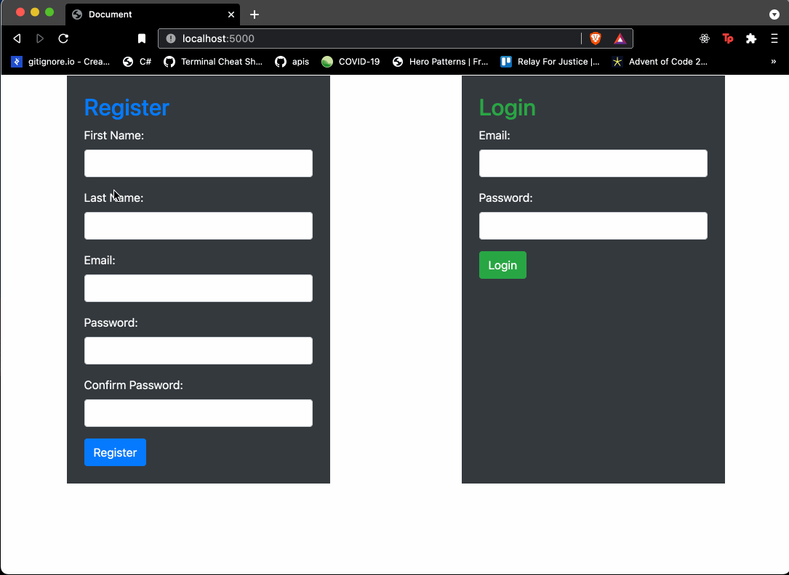

# Login and Registration

## Coding Dojo Core Assignement 07.15.2022

 

Learning Objectives:
- Students will build an application that requires login and registration.
- Students will connect a Flask application to a MySQL database.
- Students will validate a user's registration to a website.
- Students will validate a user logging in to a website.
- Students will process a user logging out of an application.
- Students will implement session.

 

In this assignment, you're going to build a Flask application that allows login and registration. We've learned about how we can connect to the database, insert records posted from a form, retrieve records from a database and set a session/flash for any error or success messages that we get along the way. One of the major components to every website is login and registration.

 

### **Registration**

The user inputs their information, we verify that the information is correct, insert it into the database and return back with a success message. If the information is not valid, redirect to the registration page and show the following requirements:

#### **Validations and Fields to Include**

1. First Name - letters only, at least 2 characters and that it was submitted
2. Last Name - letters only, at least 2 characters and that it was submitted
3. Email - valid Email format, does not already exist in the database, and that it was submitted
4. Password - at least 8 characters, and that it was submitted
5. Password Confirmation - matches password

 

### ***Login***

When the user initially registers we would log them in automatically, but for logging in, we need to validate in a different way:

1. Check whether the email provided is associated with a user in the database
2. If it is, check whether the password matches what's saved in the database

**But how do we keep track of them once they've logged in?** I think you might already know...session! We can create a session variable that holds the user's id. From our study in database design, we know that if we have the id of any table we can gather the rest of the information that is associated with that id. Storing a single session variable with the user's id is all we need to access all the information associated with that user.

 

### **Logout**

On the success page, have a logout button or link. When a user logs out, their session should be cleared. If the user attempts to access the success page (i.e. making a GET request by typing in the url), redirect them back to the login and registration page.

 

### **BONUS:**
Add more fields to your registration form with different form elements. For example, include a drop down menu, radio buttons, checkboxes, and a date picker. Include validations for each field. Have users provide their birthday, and require that they must be at least ten years old in order to register. Level up your password validations by requiring at least one capital letter and one number. Provide the user with several programming languages, and require that they check at least one as an interest of theirs. Customize this assignment and get creative!

 

### **Step:**

- Create a new Flask project
- Create a new MySQL database with a table and the appropriate fields
- The root route should display a template with the login and registrations forms
- Validate the registration input
- If registration is invalid errors messages should be displayed on the index page
- If registrations is valid, hash the password and save the user in the database, store the user in session and then redirect to the success page
- Validate the login input
- If the login is invalid, display an error message on the index page
- If login is valid, store the user in session and then redirect to the success page
- Add a functioning logout button to the success page that clears session
- After logging out, ensure you cannot reach the success page
- NINJA Bonus: Add an additional validation on passwords to have a least 1 number and 1 uppercase letter
- SENSEI Bonus: Add additional input types on the form. Get creative with you validations! (Consider including a date picker, radio buttons and/or checkboxes)